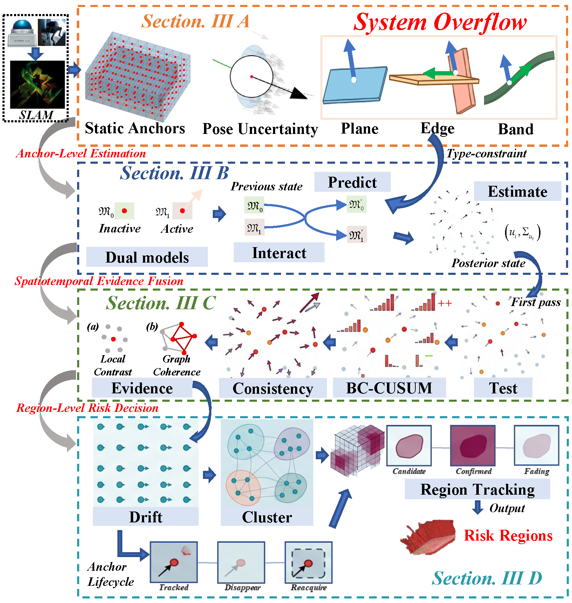
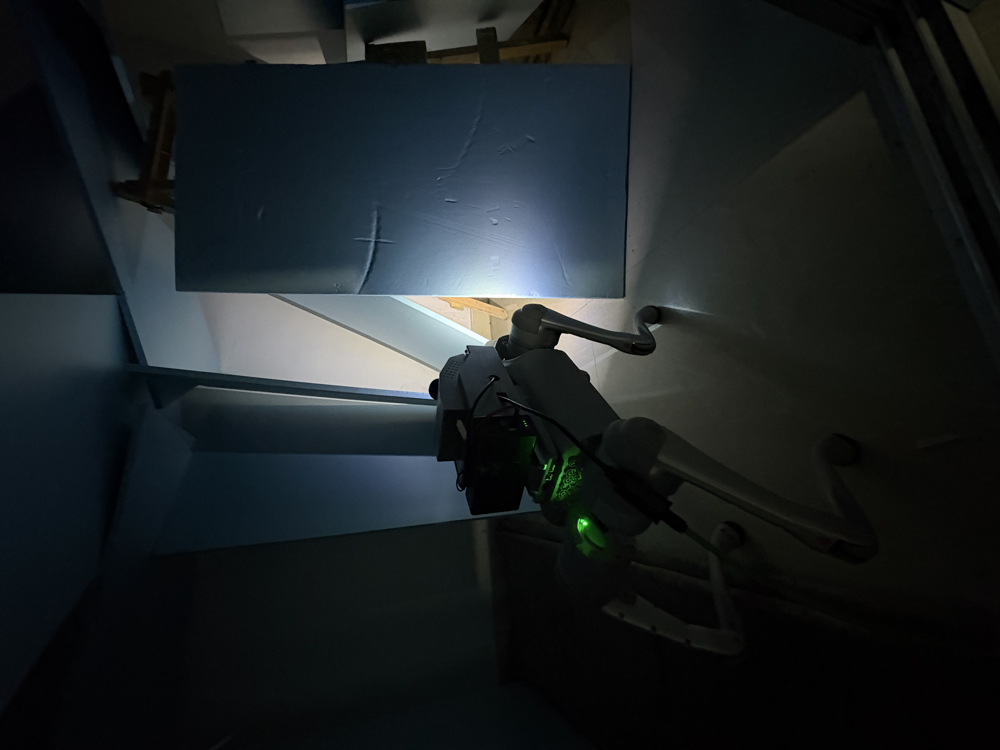

# ALERT

<p align="center">
  <strong>LiDAR Early Warning of Structural Deformation for Robotic Rescue</strong>
</p>

<p align="center">
  
  
  
  
  
</p>

<p align="center">
  
</p>

## Demo Video

<p align="center">
  <a href="docs/assets/tanta_anchor4.mp4">
    
  </a>
</p>

<p align="center">
  Click the cover image to open the demo video.
</p>

This video shows a typical collapse scene in a confined space. In this run, two severe collapse events occur one after another, which makes it a representative example for demonstrating the ALERT system.

## 1. Overview

Secondary collapse is a major operational hazard in post-disaster rescue, where subtle local structural responses may precede abrupt failure. ALERT is an onboard LiDAR-based perception and warning framework for mobile rescue robots. Instead of using LiDAR only for mapping and localization, ALERT focuses on online structural-risk perception under weak references, platform motion, sparse non-repetitive scanning, and partial observability.

At a system level, ALERT combines four tightly connected stages: a frozen anchor representation for reference modeling, uncertainty-aware observation construction, type-constrained dual-model state estimation, and multi-stage evidence verification for region-level risk decision. The goal is to detect persistent structural risk cues while suppressing false responses caused by pose drift, background variation, and scan-pattern artifacts.

This repository is organized as a catkin source space and includes the following main components:

| Module | Role |
| --- | --- |
| `deform_monitor_v2/` | Core ALERT package: anchor modeling, estimation, risk verification, visualization, and recorders |
| `FAST_LIO/` | LiDAR-inertial odometry backend used as the upstream pose and covariance source |
| `livox_ros_driver/` | ROS driver for Livox sensors |
| `gazebo_test/Mid360_simulation_plugin/livox_laser_simulation/` | Gazebo-based Livox simulation package and launch flow |
| `analysis_script/` | Offline analysis and figure-generation utilities |

## 2. Dependencies

### Tested environment

- Ubuntu 20.04
- ROS Noetic
- Gazebo 11
- GCC / G++ with C++14 support
- Python 3

### System packages

If you already have `ros-noetic-desktop-full`, most ROS-side dependencies are covered. A minimal practical setup for this repository is:

```bash
sudo apt update
sudo apt install -y \
  build-essential cmake git \
  libeigen3-dev libboost-all-dev libpcl-dev \
  python3-pip python3-yaml \
  ros-noetic-desktop-full \
  ros-noetic-pcl-ros \
  ros-noetic-pcl-conversions \
  ros-noetic-gazebo-ros \
  ros-noetic-gazebo-plugins \
  ros-noetic-gazebo-msgs \
  ros-noetic-xacro \
  ros-noetic-robot-state-publisher \
  ros-noetic-tf \
  ros-noetic-tf2-ros
```

For the analysis utilities, install:

```bash
python3 -m pip install numpy matplotlib
```

### Workspace layout

This repository is intended to be used as the `src/` directory of a catkin workspace.

```bash
mkdir -p ~/alert_ws
git clone https://github.com/zhongguanLiu/Alert.git ~/alert_ws/src
cd ~/alert_ws
source /opt/ros/noetic/setup.bash
catkin_make
source devel/setup.bash
```

### Runtime output directories

By default, recorder outputs are written to user-local ROS-style directories:

- Simulation output: `~/.ros/alert/output`
- Real-run output: `~/.ros/alert/real_output`

This keeps runtime artifacts out of the source tree and makes the repository portable across machines.

### Simulation asset note

I did not include the Gazebo scan-pattern files and mesh assets in this repository because they are relatively large and would make the public code release unnecessarily heavy.

As a result, this repository is sufficient for reading the code, building the main packages, and understanding the full pipeline, but the Gazebo simulation will not run out of the box unless those assets are restored locally.

If you need the simulation assets for reproduction, please open an Issue in this repository and I can provide them separately.

## 3. Build & Run

### Build

```bash
cd ~/alert_ws
source /opt/ros/noetic/setup.bash
catkin_make
source devel/setup.bash
```

### Simulation launch flow

Use four terminals. In each terminal, source the same environment first:

```bash
source /opt/ros/noetic/setup.bash
source ~/alert_ws/devel/setup.bash
```

Then launch the pipeline in this order.

**Terminal 1: Gazebo simulation**

```bash
roslaunch livox_laser_simulation mid360_fastlio.launch
```

**Terminal 2: FAST-LIO**

```bash
roslaunch fast_lio mapping_mid360.launch
```

**Terminal 3: ALERT + recorder**

```bash
roslaunch deform_monitor_v2 deform_monitor_v2_sim.launch \
  enable_sim_experiment_recorder:=true \
  ablation_variant:=full_pipeline \
  scenario_id:=demo_case
```

**Terminal 4: controlled object motion**

```bash
roslaunch livox_laser_simulation debris_block_02_motion.launch \
  control_mode:=multi \
  scenario_id:=demo_case \
  start_delay:=8.0 \
  duration:=60.0 \
  model_01_name:=model_01 \
  model_02_name:=model_02 \
  model_01_command_frame:=world \
  model_02_command_frame:=world \
  model_01_linear_y:=0.0010 \
  model_02_linear_x:=-0.0010
```

The simulation recorder will write run outputs under `~/.ros/alert/output/<YYYYMMDD>/sim_run_xxx/`.

### Real-world recorder launch

For real robot runs, start the monitoring node and real-run recorder with:

```bash
roslaunch deform_monitor_v2 deform_monitor_v2_real.launch
```

The recorder writes results under `~/.ros/alert/real_output/<YYYYMMDD>/real_run_xxx/`.

---

For questions about the ALERT package implementation, contact: `zgliu@cumt.edu.cn`
